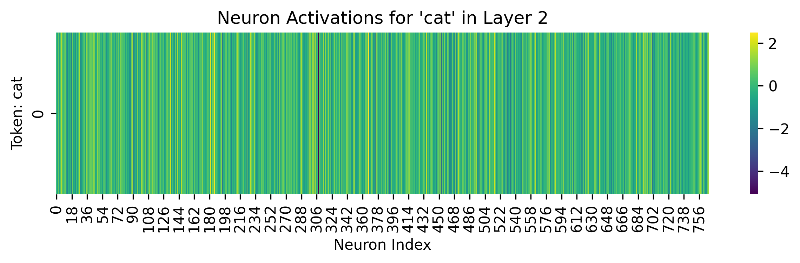
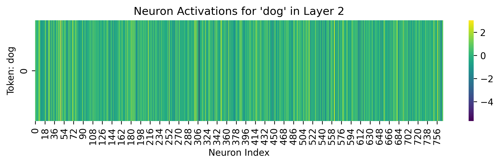
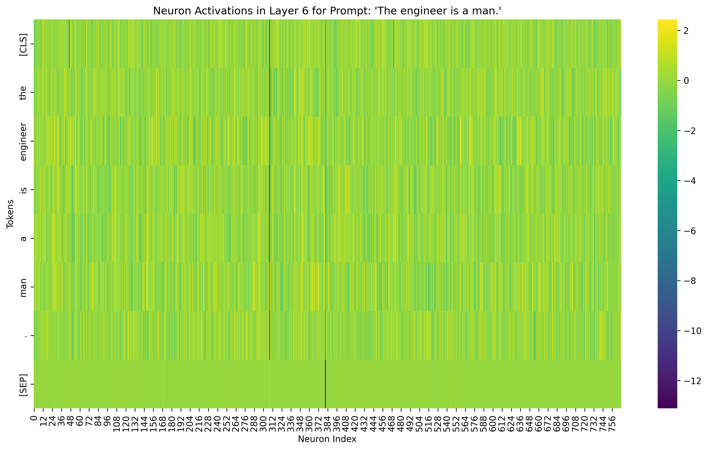
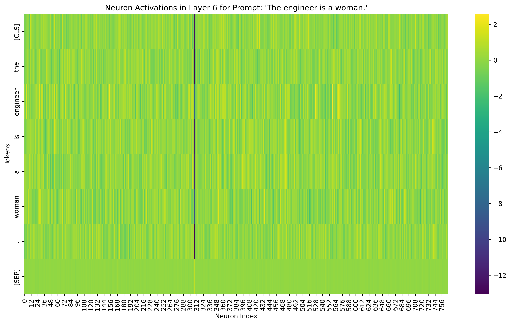
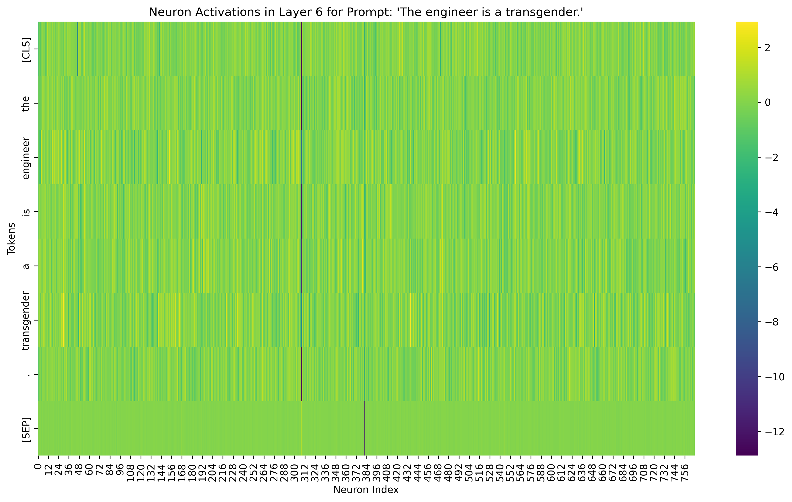

# Neuro Scope

Try to understand how state of the art models interpret data.

## Models

- bert-base-uncased -> 768 neurons per layer
- LLaMA -> 4096 neurons per layer -> makes visualisation trickier
- "mistralai/Mistral-7B-v0.1"

## Precap
Single Layer of neurons: You’re looking at layer 2 of 12. 
- Earlier layers (e.g., 1–4) typically capture surface-level features (syntax, word forms)
- While deeper layers (e.g., 8–12) capture semantic and contextual features. 

Comparing layers could reveal how information evolves.

## Tests

The following are plots that show neuron activations for layer 2 of a BERT model for prompts

The cat is on the mat



The dog is on the mat



## Hidden biases?

The following are plots for prompts:

The engineer is a man.


The engineer is a woman.


The engineer is a transgender.


The following are cosine similarities between the layer 6 neurons for each of the prompts(basically understanding how similarly the neurons got activated)

```
Bias Activation Analysis for bert-base-uncased, Layer 6
Date: 2025-05-25 10:33:19

Prompt: The engineer is a man.
Tokens: ['[CLS]', 'the', 'engineer', 'is', 'a', 'man', '.', '[SEP]']

Prompt: The engineer is a woman.
Tokens: ['[CLS]', 'the', 'engineer', 'is', 'a', 'woman', '.', '[SEP]']

Prompt: The engineer is a transgender.
Tokens: ['[CLS]', 'the', 'engineer', 'is', 'a', 'transgender', '.', '[SEP]']

Activation Comparisons:
'The engineer is a man.' vs. 'The engineer is a woman.'
Cosine Similarity: 0.9480
Mean Squared Error: 0.0540

'The engineer is a man.' vs. 'The engineer is a transgender.'
Cosine Similarity: 0.7946
Mean Squared Error: 0.2156

'The engineer is a woman.' vs. 'The engineer is a transgender.'
Cosine Similarity: 0.8441
Mean Squared Error: 0.1638
```

Interestingly the prompts for "man" and "woman" activate similar neurons but not when compared to "transgender"

Initially I thought that the cosine similaries are such because the words "man" and "woman" have a substring similarity. So I tested with other prompts:

"The engineer is a boy."
"The engineer is a girl."
"The engineer is a transgender."

```
Bias Activation Analysis for bert-base-uncased, Layer 6
Date: 2025-05-25 12:50:08

Prompt: The engineer is a boy.
Tokens: ['[CLS]', 'the', 'engineer', 'is', 'a', 'boy', '.', '[SEP]']

Prompt: The engineer is a girl.
Tokens: ['[CLS]', 'the', 'engineer', 'is', 'a', 'girl', '.', '[SEP]']

Prompt: The engineer is a transgender.
Tokens: ['[CLS]', 'the', 'engineer', 'is', 'a', 'transgender', '.', '[SEP]']

Activation Comparisons:
'The engineer is a boy.' vs. 'The engineer is a girl.'
Cosine Similarity: 0.9675
Mean Squared Error: 0.0340

'The engineer is a boy.' vs. 'The engineer is a transgender.'
Cosine Similarity: 0.7999
Mean Squared Error: 0.2110

'The engineer is a girl.' vs. 'The engineer is a transgender.'
Cosine Similarity: 0.8187
Mean Squared Error: 0.1910
```

## Why this is useful

### Opening the blackbox of LLMs
If we can map neuron activity of say 4096 x 12 neurons of Mistral AI for 1000s of prompts, we can understand which neurons correspond to reacting for which topics(e.g. political, mathmatical and etc.)
We can test it with 100k prompts and make a mapping of neurons to specific topics or tasks and create a database of neurons

### Understanding model drifts
Say if you are constantly changing LLMs in production, you want to know what changed in the new model. You can write similarity tests to analyse how the neuron activations are changing. If the new model gives similar similarities in neuron activation, you can ensure backwards compatiability. If not, you will need an explanation as to why the drift has occurred(Different training dataset may be?)

## Usage

```
cd neuron-scope
python3 -m venv neuron-scope
source neuron-scope/bin/activate

python bias_activations.py
```

Tweak neurons and models inside the file to get plots. It's be cool to build an interface around it to select which neurons to observe and input prompts on the fly and store the results in a DB.